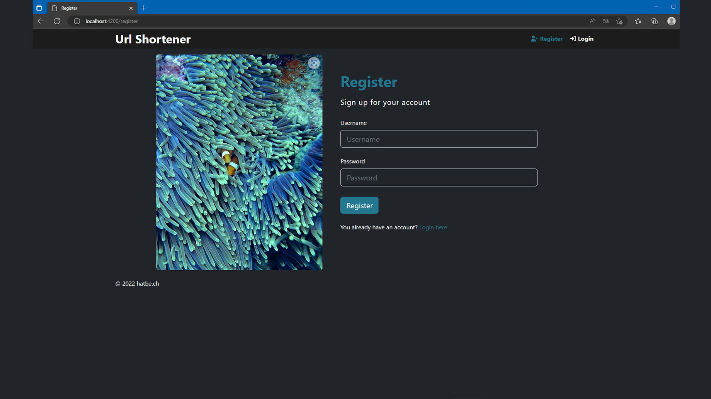
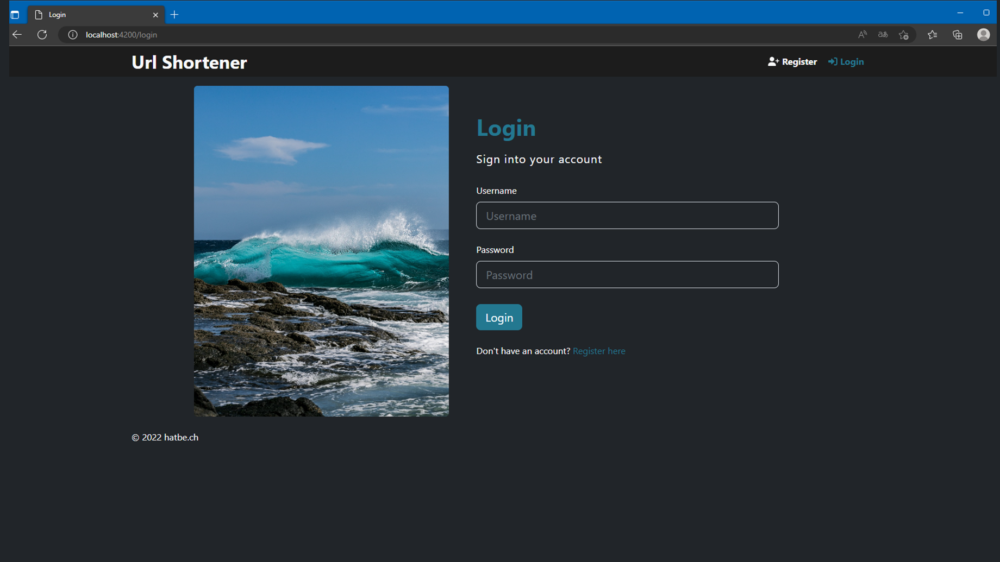

## Links:
- Youtube: https://www.youtube.com/watch?v=4TzxXNHSW2g

## Key features

- Shorten URLs
- Create, Use, Delete urls
- Tracking of url usage
- authentication system (login / register)
- User Dashboard
- User settings
- Admin Dashboard
- User Management
- Error handling

## How It's Built

The frontend of this application is developed using Angular, while the backend uses NodeJS with Express, making it a full JavaScript implementation. MongoDB has been chosen as the database for its efficiency and flexibility. For styling, the Bootstrap CSS Framework is used to provide a clean and responsive design.

The entire source code is available on GitHub for review and collaboration.

Additionally, there is a walkthrough on YouTube.

## Features

### URL Shortening for Guests

Guests can shorten URLs directly from the index page. Upon entering a URL, a shortened version is generated, which combines the server URL with a unique 9-character ID. As a guest, options to edit, delete, or view statistics of the URL are not available. The URL will remain on the server indefinitely.

### Accessing a Shortened URL (Guest or Registered User)

Shortened URLs can be entered in any browser. Users are immediately redirected to the link's destination. Each access, including time and IP address (if enabled in the backend .ENV file), is recorded in the database, accessible to the URL's owner.

### Registration Process

Users can register at the "/register" path, requiring a new username and password. Post-registration, users are redirected to the "/login" page with a query (?freshregisteredas=%username%), which auto-fills the username field and displays a success message.

### Login Functionality

Existing users can log in using their username and password. Upon successful login, users are redirected to their dashboard at "/dashboard". This area is exclusively accessible to logged-in users.

### User Dashboard

The dashboard presents a paginated list of all user-created shortened URLs. Users can view statistics (via the eye button) or delete URLs (using the trashcan icon). The URL shortening widget is available at the top of this list, along with a settings button (an additional admin button appears for admin users).

### URL Shortening for Registered Users

The URL shortening process for logged-in users on the "/dashboard" is similar to that for guests on the index page, with the added benefit of being listed as the URL's owner.

### Viewing Statistics of Personal URLs

By selecting the eye button on the "/dashboard", users access the URL info page, displaying the original URL, the shortened version, the date of creation, and access counts. A detailed list of accesses, including date and IP address, is also available. Users have the option to delete their URLs from this page.

### User Settings

Within user settings, options to change passwords, delete accounts, or remove all associated URLs are available, subject to confirmation through a modal. Users can also log out from here, a function mirrored in the header.

### Admin Dashboard

Access to the admin dashboard is restricted to admin users; others are redirected to the index page. The admin dashboard provides an overview of all users, with options to view (eye button) or delete them. New users can be created from this panel.

### Admin Dashboard User Details

Selecting the eye button in the admin dashboard reveals details of the user, including username and group (admin or user). Additionally, admins have the capability to reset passwords for users.

---

For more detailed information about this web application, please view the accompanying YouTube video, explore the live demo, or browse the code on GitHub.
