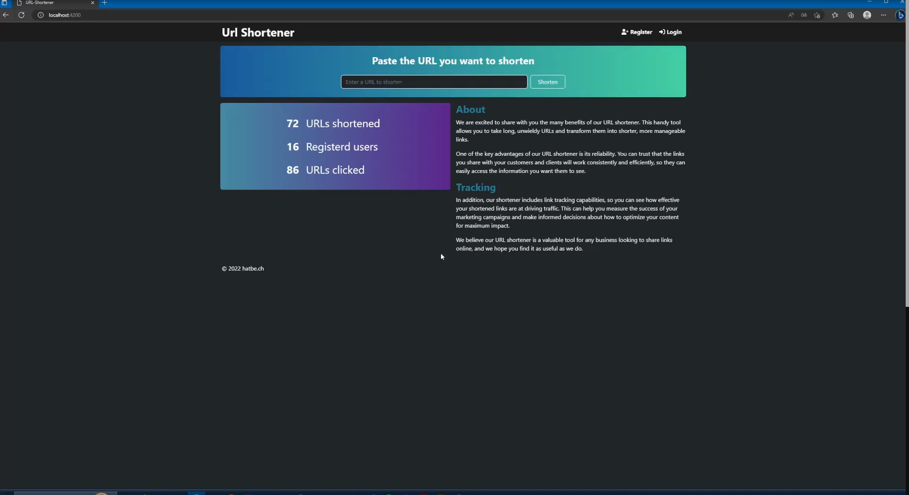
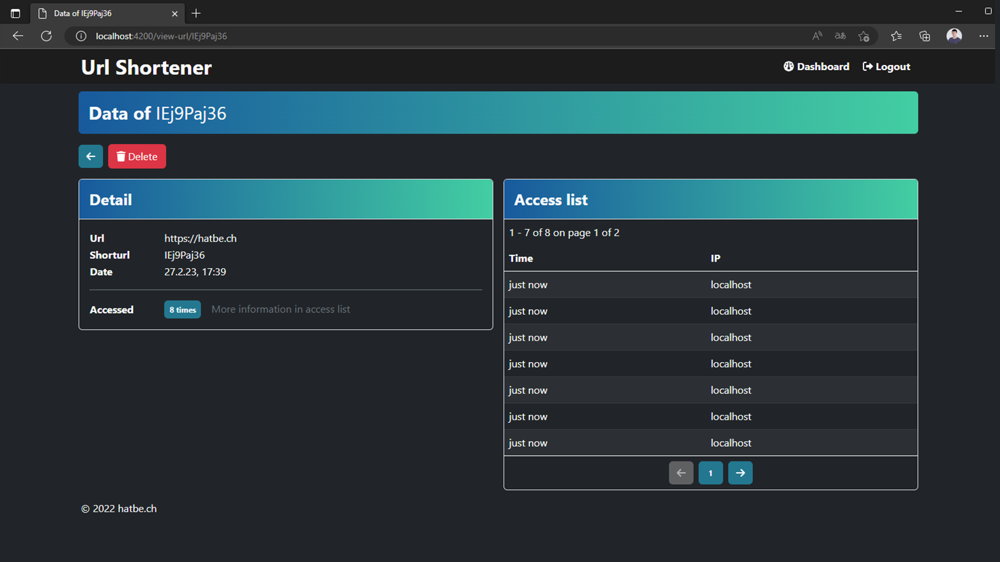

# Url Shortener

This is my first project with the MEAN-Stack. \
I used it to learn the stack and try new things. \
It's a really basic application

## How its buildt

- MEAN Stack
    - MongoDB as Database
    - Express as API
    - Angular as Frontend
    - NodeJS as backend
- Bootstrap for styles
- Fontawesome for icons

## REST API Endpoints

| HTTP-Method | Endpoint | BODY (JSON) | Authorization Header Token | Description |
|---|---|---|---|---|
| **AUTH** |  |  |  |  |
| POST | /api/v1/auth/register | username: string, password: string |  | register as new user |
| POST | /api/v1/auth/login | username: string, password: string |  | login as registered user |
| **USERS** |  |  |  |  |
| GET | /api/v1/users |  | true | get data from current loggedin user |
| DELETE | /api/v1/users |  | true | delete currently loggedin user |
| DELETE | /api/v1/users/urls |  | true | delete currently loggedin users urls |
| PATCH | /api/v1/users/password | oldpassword: string, newpassword: string | true | change password |
| **URLS** |  |  |  |  |
| POST | /api/v1/urls/ | url: string | (optional) | create a shortend url |
| GET | /api/v1/urls/:id |  |  | get a shortened url |
| GET | /api/v1/urls/:id/stats |  | true | get stats of url |
| GET | /api/v1/urls/my |  | true | get current loggedin users urls |
| DELETE | /api/v1/urls/:id |  | true | delete a url of a user (only when logged in as this user) |
| **Stats** |  |  |  |  |
| GET | /api/v1/stats/ | | | get selected stats of whole page |

## Functionality

### Submit URL as Guest

If you first join the webapp, you can insert a URL to the form.
When you press "Shorten", the url gets send to the backend, the backend replys with a new shortend URL.

If you input a wrong URL format, this gets checked (by the front and the backend :)

If everithing worked out, the website displays the new shortened URL.

### Register

The path for the login screen is <url>/register.

Here you can register an account.

The requirements are  

Username: 3-16 chars \
Password: 12-1024 chars

### Login

The path for the login screen is <url>/login.

You can login with a registered account.

### Dashboard

If you successfully logged in with you user, you get directly go to your dashboard.\
Here you get a List with all your shortened urls. (if you created them while you where loggedin...).

Here you can delete the urls permanently too or click on the eye button to access the statistics.
And access the Settings.

### Settings

In the settings, you can change the password of the currently loggedin User.

You can delete your account or all your urls.

### API

Of course you can access the underlaying API barebone. \
Here i used POST-MAN.

**Register**

**Login**

**Create URL (as loggedin user)**

**Get a URL**

**Delete Url**

**Get current loggedin user data**

**Get current loggedin users urls**

---

You can do much more with the API, just read the table above.