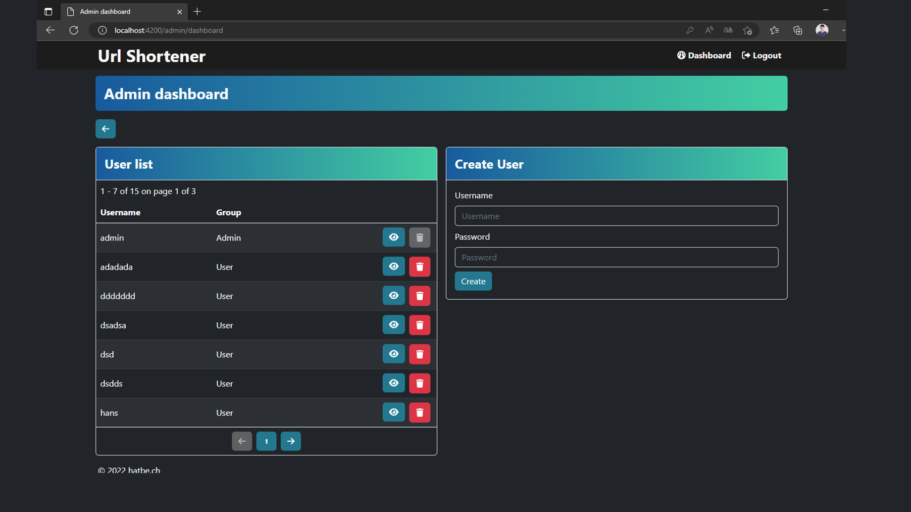

# Url Shortener

Feautures:

- Angular Frontend
- Node.JS Backend (express) (REST)
- Bootstrap CSS
- Fontawesome Icons

---

Website:

If you enter e wrong URL format. \
This is checked in the frontend and in the backend, with the same regex check.

If you enter a right URL format, you get this screen. \
If you click on the copy to clipboard button, you copy the URL to the clipboard.

If you now enter this link in the Browsers addressbar, you get automaticly redirected to the specified page.

---

You also can create a shortend URL over the same REST-API the angular frontend uses.

And of course, you can get any short URL over the API too.

